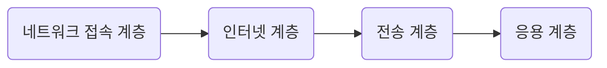
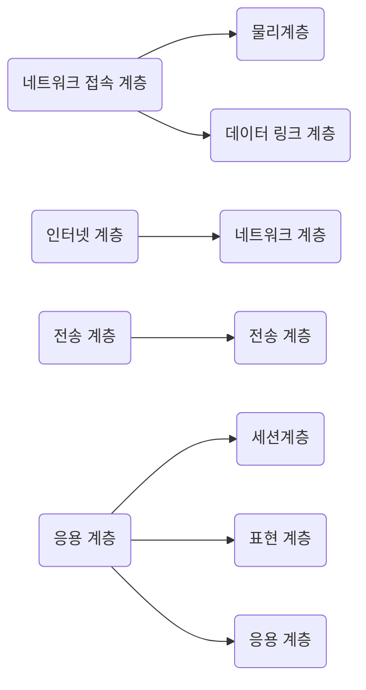

# TCP/ IP 

> 인터넷 통신을 위한 모델이다.
> 
> OSI 7 Layer는 표준 모델이다. 하지만 현실은 인터넷을 위해서 
> 
> 사용하는 모델은 TCP/IP이다.

OSI 7 Layer 와 TCP/IP 비교 

왼쪽 TCP/IP  &nbsp; &nbsp; &nbsp; &nbsp; &nbsp; &nbsp; &nbsp; &nbsp; &nbsp; &nbsp; &nbsp; &nbsp; 오른쪽 OSI 7 Layer

