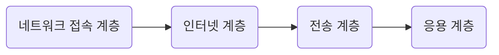
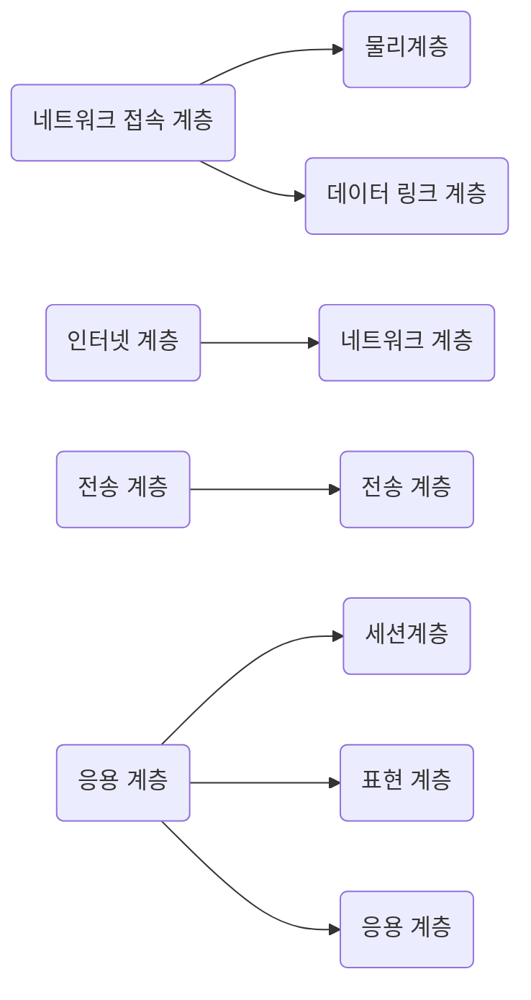

# TCP/ IP 

> 인터넷 통신을 위한 모델이다.
> 
> OSI 7 Layer는 표준 모델이다. 하지만 현실은 인터넷을 위해서 
> 
> 사용하는 모델은 TCP/IP이다.

OSI 7 Layer 와 TCP/IP 비교 

왼쪽 TCP/IP  &nbsp; &nbsp; &nbsp; &nbsp; &nbsp; &nbsp; &nbsp; &nbsp; &nbsp; &nbsp; &nbsp; &nbsp; 오른쪽 OSI 7 Layer

### IP

##### IPv4

> 32 비트로 구성되어져있다. (2^32개 IP 주소) -> 0.0.0.0 ~ 255.255.255.255
> 
> 비트로 표시화게 되면 8비트.8비트.8비트.8비트가 된다.
>
> 총 5개로 클래스가 분류가 되는데 

A Class(0 ~ 127.255.255.255)

B Class(128 ~ 191.255.255.255)

C Class(192 ~ 223.255.255.255)

D Class(224 ~ 239.255.255.255)

E Class(240 ~ 255.255.255.255)

A,B,C 클래스가 주로 사용된다.

#### IPv6

128비트로 구성 되어져 있다.

16비트:16비트:16비트:16비트:16비트:16비트:16비트:16비트
