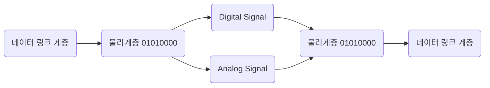

# 네트워크 

> 네트워크는 컴퓨터간의 통신을 의미한다.
> 
> 예시)
> >
> > 컴퓨터 간 파일 송수신, 웹 사이트, 이메일 열람 등등 
> 
> 컴퓨터간의 통신을 위한 규칙이 있다.(프로토콜)
 
 
 

### OSI 7 layer 

 컴퓨터간 데이터 전송을 지원할 수 있는 추상 모델을 표준화 한것이다.
 
 즉, 간단하게 말을 하면 컴퓨터끼리 서로 데이터를 전송하기 위한 규칙이라는 것이다.

1계층(물리 계층)(Physical Layer) ==> 시스템간 물리적 연결과 전기신호 변환 및 제어 

2계층(데이터링크 계층)(Data Link Layer) ==> 네트워크 기기간 데이터 전송 및 물리 주소 결정 

3계층(네트워크 계층)(Network Layer) ==> 다른 네트워크와 통신을 위한 경로 설정 및 논리 주소 결정 

4계층(전송 계층)(Transport Layer) ==> 신뢰할 수있는 통신 구현 

5계층(세션 계층)(Session Layer)==> 세션 채결, 통신 방식등을 결정 

6계층(표현 계층)(Presentation Layer)  ==> 문자코드, 압축, 암호화등의 데이터 변환 담당 
7계층(응용 계층)(Application Layer) ==> 이메일, 파일 전송, 웹 사이트 열람 등 애플리케이션에 대한 서비스 제공 

### 물리계층 

> 데이터를 전기 신호를 변환하여 송수신한다.
>
> 즉, 무선으로 오든 유선으로 오든 그 데이터를 0,1로 바꿔주는 역할을 한다고 생각하면 된다.

### 데이터 링크 계층 

> 물리적 네트워크 사이의 데이터 송수신 담당한다.
> 
> 대표적인 프로토콜 : 이더넷 프로토콜
>
> MAC 주소를 통해서 통신한다.

만약에 A 라는 컴퓨터에서 B라는 컴퓨터로 데이터 전송한다고 하면 

A와 B는 각각의 MAC의 주소를 가지고 있을 것이다. 

A와 B의 MAC 의 주소를 넣어서 다음 계층으로 전달된다.

Sauce MAC Address 는 출발지 이다.

Desitnation MAC Address는 목적지 주소이다.

즉, Desitnation MAC Address는 자기 컴퓨터의 MAC 주소가 맞는지 확인하고 맞으면 

다음 계층으로 넘기게 된다.

 
 
 
  
### 네트워크 계층 
  
> 다양하고 방대한 네트워크 상에서, 컴퓨터간 논리적 연결을 위해서 네트워크 계층이 필요하다.
>
> 대표적인 프로토콜 (IP 프로토콜)

 
